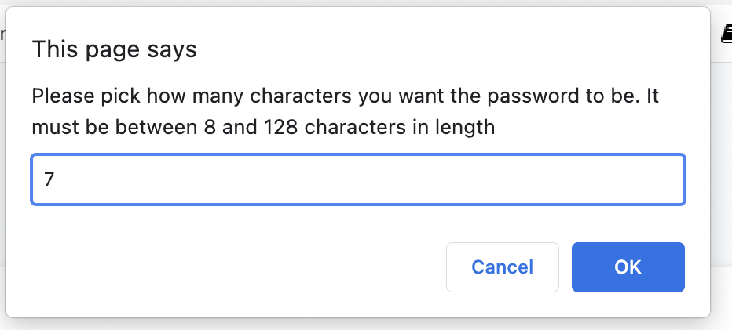
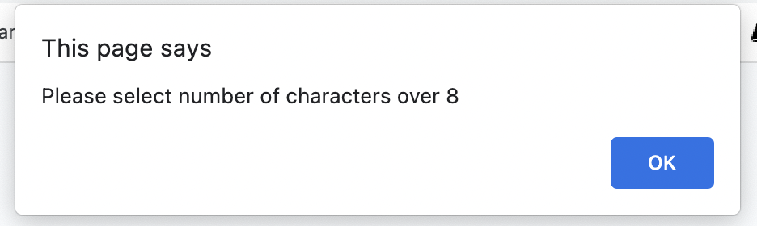

# password-generator-homework

## Description
- The aim of this code is to generate a random password after the user goes through a series of prompts

- There will be validations in place so that certain criteria are met, this includes the password being no less than 8 and no more than 128, if a number outside this range is selected the user will get an alert to start again. The other validation will make sure at least one of the following criteria are selected: lowercase characters, uppercase characters, special characters and numbers.

- The user will be taken through a series of prompts and confirms to select the criteria their password will be made up of. Once they have made a selection for all the generator will create a password of the given the character length they selected on the first prompt, this will be made up of the character sets they have selected through the confirm messages.

## Generator
- The generator has been created to take the user through a series of prompts that will then determine how their password is made up. Based on the user selections throughout these prompts different characters will be assigned to a variable which will the have random characters chosen based on their index number in that string, until the number of characters chosen matches the password length selected at the beginning.

- There are validations in place to ensure the password meets certain criteria such as character length must be at least 8, and no more than 128. A screenshot has included to show what happens when 7 is selected, and the error message shown:

- There are other validations in place to ensure the rest of the criteria are met, such as at least one type of character being selected.

- The website is deployed here: [deployed project](https://danlawrence91.github.io/password-generator-homework/)

## Future features
- This generator is able to have features added to it in the future, the CSS could also be expanded to make page have a better styling.
- One feature I will look to add is a feature to copy the password generated to the clipboard so the user only needs to click copy, this or the user can click on the password generated and it will select all, therefore making it easier for the user to copy the password to use.

## Contributions
- The HTML and CSS were provided as was the event listener on the .js file. 
